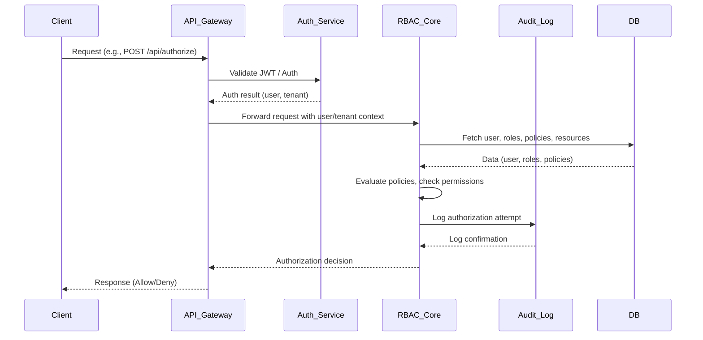

# High-Level Architecture: Multi-Tenant RBAC/IAM System

## Overview
This system is a stateless, multi-tenant RBAC/IAM platform built with NestJS in a monorepo structure. It enforces strict tenant isolation, policy-driven authorization, and scalable microservices. The architecture is modular, API-first, and designed for extensibility and security.

## Core Components
- **API Gateway**: Entry point for all requests. Handles routing, authentication, rate limiting, logging, and API documentation.
- **RBAC Core Service**: Manages tenants, users, roles, resources, and policies. Evaluates permissions and enforces policy-driven access control.
- **Auth Service**: Handles authentication (JWT/OAuth2), user login, and future SSO/IdP integration.
- **Audit Log Service**: Records all policy changes, permission checks, and admin actions for compliance and traceability.
- **Database**: PostgreSQL with row-level isolation for tenants. Managed via TypeORM or Prisma.

## Data Flow Sequence Diagram

## Service Responsibilities
- **API Gateway**: Authentication, routing, rate limiting, logging, API docs
- **RBAC Core**: Tenants, users, roles, policies, resources, permission checks, policy evaluation
- **Auth Service**: JWT/OAuth2, SSO/IdP integration
- **Audit Log Service**: Policy updates, permission checks, admin actions
- **Database**: Multi-tenant isolation, migrations, seeders

## Key Principles
- Strict Multi-Tenant Isolation (tenant_id everywhere)
- Policy-Driven Authorization (IAM-style)
- API-First, stateless service design
- Modular monorepo for easy extension
- Audit logs and observability baked in

## Extensibility
- Add new microservices (e.g., resource-mgmt, analytics) via Nx/NestJS libraries
- Future support for gRPC, GraphQL, external IdPs

## References
- [NestJS Docs](https://docs.nestjs.com)
- [Nx Monorepo](https://nx.dev)
- [TypeORM](https://typeorm.io)
- [Policy-based Authorization (IAM)](https://docs.aws.amazon.com/IAM/latest/UserGuide/access_policies.html)

---
For more details, see the WARP.md and README.md files in the project root.
