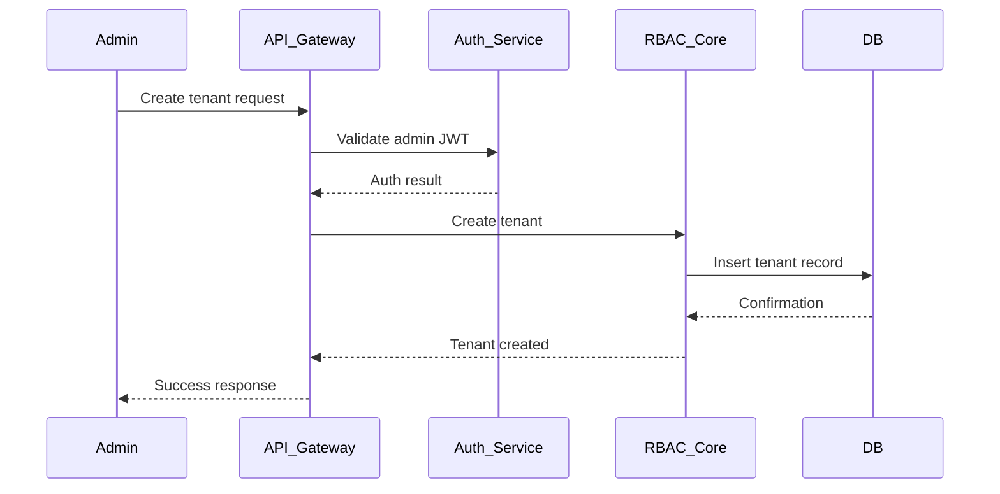
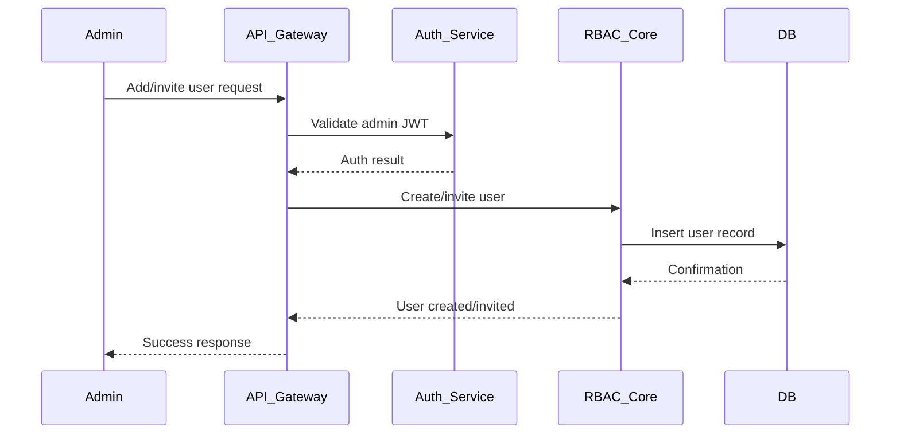
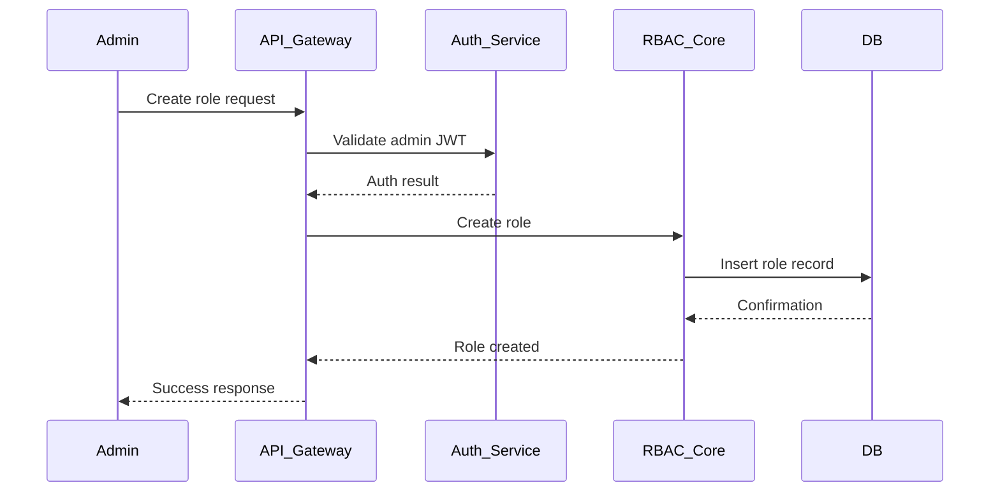
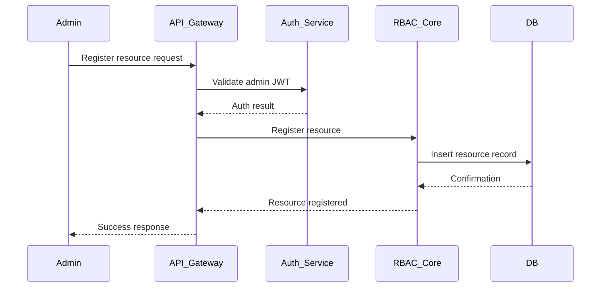
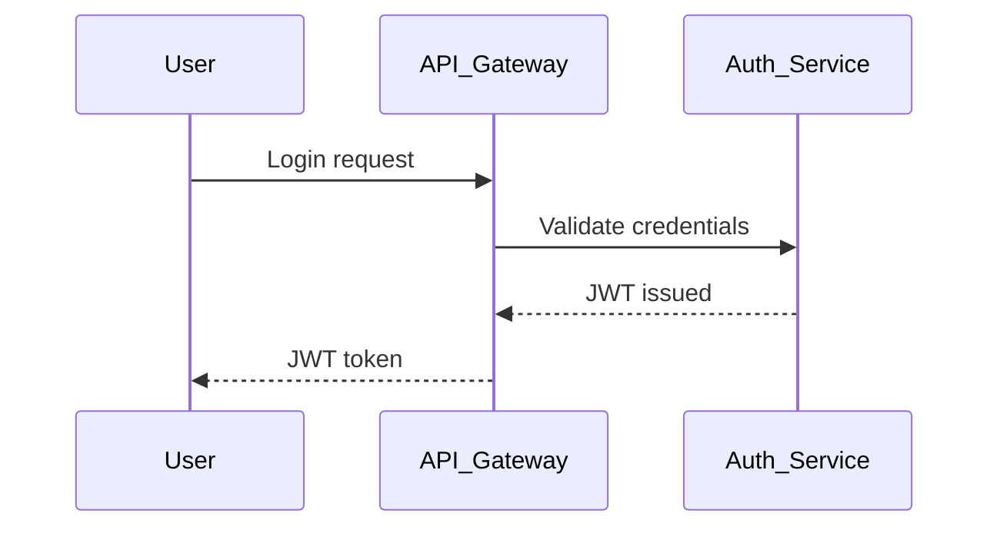
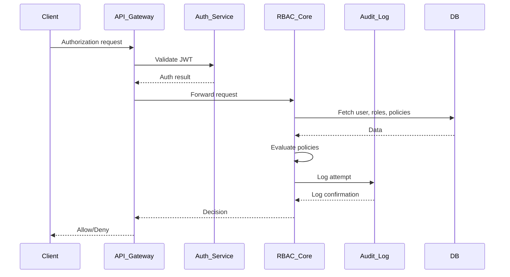
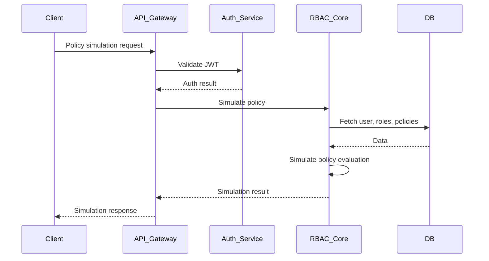
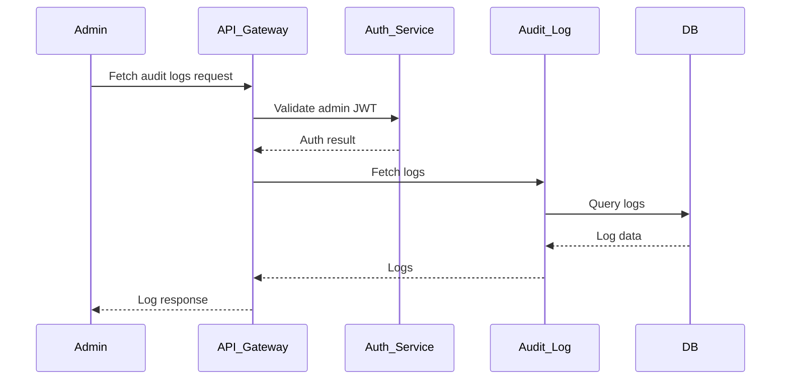

# Detailed Architecture: Multi-Tenant RBAC/IAM System

## 1. Component Overview

### Covered (Implemented)
- **API Gateway**
  - Routing, authentication, logging, rate limiting, Swagger docs
- **RBAC Core Service**
  - Tenants, users, roles, resources, policies
  - Permission checks, policy evaluation
- **Auth Service**
  - JWT authentication, login endpoints
- **Audit Log Service**
  - Logging of policy changes, permission checks, admin actions
- **Database (Postgres)**
  - Row-level isolation, entities, migrations
- **Monorepo Structure**
  - Nx/NestJS, modular apps and libraries

### Needs to be Covered (Planned/Missing)
- **SSO/IdP Integration**
  - OAuth2, external identity providers
- **Advanced Policy Conditions**
  - Attribute-based access, custom conditions
- **Resource Management Service**
  - CRUD for resources, resource types
- **Analytics/Reporting Service**
  - Usage, access patterns, compliance
- **gRPC/GraphQL Support**
  - Alternative API protocols
- **Comprehensive Test Coverage**
  - E2E, integration, unit tests
- **CI/CD Pipeline**
  - Automated build, test, deploy
- **API Rate Limiting per Tenant**
  - Fine-grained throttling
- **Multi-Region/HA Deployment**
  - Scalability, failover

## 2. Data Flow & Sequence Diagrams

### Tenant Flows
#### Create Tenant (`POST /api/tenants`)

### User Flows
#### Add/Invite User (`POST /api/tenants/:tenant_id/users`)

### Role Flows
#### Create Role (`POST /api/tenants/:tenant_id/roles`)

### Resource Flows
#### Register Resource (`POST /api/tenants/:tenant_id/resources`)

### Auth Flows
#### Login/Authenticate (JWT)

### Policy Flows
#### Permission Check (`POST /api/authorize`)

#### Policy Simulation (`GET /api/tenants/:tenant_id/policy-simulate`)

### Audit Flows
#### Audit Log Fetch (`GET /api/tenants/:tenant_id/audit-logs`)

## 3. Component Responsibilities

### API Gateway
- Entry point, authentication, routing, rate limiting, logging, API docs

### RBAC Core
- Tenants, users, roles, resources, policies
- Permission checks, policy evaluation

### Auth Service
- JWT/OAuth2 authentication, login, SSO/IdP integration (future)

### Audit Log Service
- Policy updates, permission checks, admin actions

### Database
- Multi-tenant isolation, migrations, seeders

## 4. Coverage Checklist
| Component                | Status      | Notes                                    |
|-------------------------|-------------|------------------------------------------|
| API Gateway             | Implemented | Swagger, logging, rate limiting present  |
| RBAC Core               | Implemented | Policy engine, entities, DTOs present    |
| Auth Service            | Implemented | JWT, login endpoints                     |
| Audit Log Service       | Implemented | Logging actions, policy changes          |
| SSO/IdP Integration     | Planned     | OAuth2, external IdP support             |
| Resource Management     | Partial     | CRUD endpoints, types                    |
| Analytics/Reporting     | Planned     | Usage, compliance, access logs           |
| gRPC/GraphQL Support    | Planned     | API protocol alternatives                |
| CI/CD Pipeline          | Partial     | GitHub Actions, needs deploy steps       |
| Multi-Region/HA         | Planned     | Scalability, failover                    |
| Test Coverage           | Partial     | E2E, integration, unit tests             |

## 5. Recommendations & Next Steps
- Implement SSO/IdP integration for enterprise use cases
- Expand policy engine for attribute-based and custom conditions
- Add analytics/reporting microservice
- Enhance CI/CD for automated deployment
- Increase test coverage (unit, integration, E2E)
- Document API endpoints and flows in `/docs`
- Plan for multi-region deployment and HA

## 6. References & Resources
- [NestJS Docs](https://docs.nestjs.com)
- [Nx Monorepo](https://nx.dev)
- [TypeORM](https://typeorm.io)
- [Policy-based Authorization (IAM)](https://docs.aws.amazon.com/IAM/latest/UserGuide/access_policies.html)

---
This document provides end-to-end clarity on the architecture, current coverage, and future roadmap for the multi-tenant RBAC/IAM system.
