# Detailed Architecture: Multi-Tenant RBAC/IAM System

## 1. Component Overview

### Covered (Implemented)

- **API Gateway**
  - Routing, authentication, logging, rate limiting, Swagger docs
- **RBAC Core Service**
  - Tenants, users, roles, resources, policies
  - Permission checks, policy evaluation
- **Auth Service**
  - JWT authentication, login endpoints
- **Audit Log Service**
  - Logging of policy changes, permission checks, admin actions
- **Database (Postgres)**
  - Row-level isolation, entities, migrations
- **Monorepo Structure**
  - Nx/NestJS, modular apps and libraries

### Needs to be Covered (Planned/Missing)

- **SSO/IdP Integration**
  - OAuth2, external identity providers
- **Advanced Policy Conditions**
  - Attribute-based access, custom conditions
- \*\*Re## 10. Admin Registration & User Invitation Architecture Details

### 10.1 Service Communication Patterns

#### Admin Registration Flow Design Decisions

**Why Auth Service is Central to Registration:**

1. **Credential Management**: Auth Service owns all password hashing, token generation, and authentication logic
2. **Security Isolation**: Separates authentication concerns from business logic in RBAC Core
3. **JWT Claims**: Auth Service embeds user roles/permissions into JWT tokens for stateless authorization
4. **Audit Trail**: All authentication attempts and credential changes are logged in one place

**Inter-Service Communication:**

```
Admin Registration:
SuperAdmin → API Gateway → Auth Service → RBAC Core → Database
                ↓
        Email Service (notifications)

User Invitation:
Admin → API Gateway → Auth Service (validation) → RBAC Core (business logic) → Auth Service (credentials) → Email Service
```

### 10.2 Database Schema for User Registration

#### Auth Service Tables

```sql
-- Authentication credentials and tokens
CREATE TABLE auth_credentials (
  id UUID PRIMARY KEY,
  user_id UUID NOT NULL, -- Links to RBAC Core user
  email VARCHAR(255) UNIQUE NOT NULL,
  password_hash VARCHAR(255),
  status ENUM('pending', 'active', 'suspended', 'locked'),
  failed_login_attempts INTEGER DEFAULT 0,
  last_login TIMESTAMP,
  created_at TIMESTAMP DEFAULT NOW(),
  updated_at TIMESTAMP DEFAULT NOW()
);

-- Invitation and activation tokens
CREATE TABLE auth_tokens (
  id UUID PRIMARY KEY,
  user_id UUID NOT NULL,
  token_type ENUM('invitation', 'activation', 'password_reset', 'refresh'),
  token_hash VARCHAR(255) NOT NULL,
  expires_at TIMESTAMP NOT NULL,
  used_at TIMESTAMP,
  metadata JSONB,
  created_at TIMESTAMP DEFAULT NOW()
);
```

#### RBAC Core Tables

```sql
-- User profiles and tenant associations
CREATE TABLE users (
  id UUID PRIMARY KEY,
  tenant_id UUID,
  email VARCHAR(255) NOT NULL,
  status ENUM('pending_invitation', 'pending_activation', 'active', 'suspended'),
  profile JSONB,
  invited_by UUID,
  activated_at TIMESTAMP,
  created_at TIMESTAMP DEFAULT NOW(),
  updated_at TIMESTAMP DEFAULT NOW()
);

-- User role assignments
CREATE TABLE user_roles (
  id UUID PRIMARY KEY,
  user_id UUID NOT NULL,
  role_id UUID NOT NULL,
  assigned_by UUID,
  assigned_at TIMESTAMP DEFAULT NOW(),
  UNIQUE(user_id, role_id)
);
```

### 10.3 Security Considerations

#### Token Security

```typescript
// Invitation token generation (Auth Service)
interface InvitationToken {
  userId: string;
  tenantId: string;
  email: string;
  roleIds: string[];
  permissions: string[];
  expiresAt: Date;
  invitedBy: string;
}

// JWT Claims for authenticated users
interface JWTClaims {
  sub: string; // user ID
  email: string;
  tenantId?: string;
  roles: string[];
  permissions: string[];
  userType: 'admin' | 'user';
  iss: 'auth-service';
  exp: number;
  iat: number;
}
```

#### Password Policy Enforcement

```typescript
// Auth Service password validation
class PasswordPolicy {
  static validate(password: string): ValidationResult {
    const rules = [
      { test: /.{8,}/, message: 'At least 8 characters' },
      { test: /[A-Z]/, message: 'At least one uppercase letter' },
      { test: /[a-z]/, message: 'At least one lowercase letter' },
      { test: /[0-9]/, message: 'At least one number' },
      { test: /[!@#$%^&*]/, message: 'At least one special character' }
    ];

    const failures = rules.filter(rule => !rule.test.test(password));
    return {
      valid: failures.length === 0,
      errors: failures.map(f => f.message)
    };
  }
}
```

### 10.4 Error Handling & Edge Cases

#### Invitation Expiration Handling

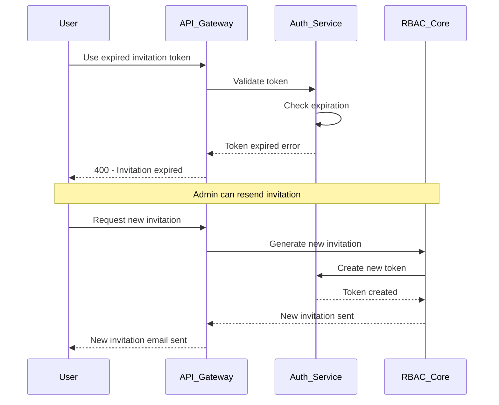

#### Duplicate Email Handling

```typescript
// Auth Service - Handle duplicate registrations
async registerUser(data: RegisterUserDto): Promise<RegisterResult> {
  const existingUser = await this.findByEmail(data.email);

  if (existingUser) {
    if (existingUser.status === 'pending_invitation') {
      // Update existing invitation instead of creating new
      return this.updateInvitation(existingUser.id, data);
    } else {
      throw new ConflictException('User already exists');
    }
  }

  return this.createNewUser(data);
}
```

### 10.5 Event-Driven Architecture

#### Domain Events for User Registration

```typescript
// Events published during registration flows
export enum UserEvents {
  ADMIN_REGISTERED = 'admin.registered',
  USER_INVITED = 'user.invited',
  USER_REGISTERED = 'user.registered',
  USER_ACTIVATED = 'user.activated',
  INVITATION_EXPIRED = 'invitation.expired',
  LOGIN_FAILED = 'auth.login.failed',
  PASSWORD_CHANGED = 'auth.password.changed'
}

// Event handlers for cross-service communication
@EventHandler(UserEvents.USER_INVITED)
async handleUserInvited(event: UserInvitedEvent) {
  await this.emailService.sendInvitation({
    email: event.email,
    invitationUrl: event.invitationUrl,
    tenantName: event.tenantName,
    invitedBy: event.invitedByName
  });

  await this.auditService.logEvent({
    action: 'user_invited',
    tenantId: event.tenantId,
    actorId: event.invitedBy,
    targetId: event.userId,
    metadata: { email: event.email }
  });
}
```

### 10.6 Multi-Tenant Isolation in Registration

#### Tenant-Scoped User Registration

````typescript
// RBAC Core - Ensure users are scoped to correct tenant
async inviteUserToTenant(tenantId: string, userData: InviteUserDto, invitedBy: string) {
  // Verify admin has permission to invite users to this tenant
  const hasPermission = await this.authorizationService.checkPermission({
    userId: invitedBy,
    action: 'user:invite',
    resource: `arn:app:${tenantId}:user:*`,
    context: { tenantId }
  });

  if (!hasPermission) {
    throw new ForbiddenException('Insufficient permissions to invite users');
  }

  // Create user with tenant isolation
  const user = await this.userRepository.create({
    ...userData,
    tenantId,
    invitedBy,
    status: 'pending_invitation'
  });

  // Generate invitation token scoped to tenant
  const invitationToken = await this.authService.generateInvitationToken({
    userId: user.id,
    tenantId,
    email: userData.email,
    roleIds: userData.roleIds
  });

  return { user, invitationToken };
}
```ource Management Service**
  - CRUD for resources, resource types
- **Analytics/Reporting Service**
  - Usage, access patterns, compliance
- **gRPC/GraphQL Support**
  - Alternative API protocols
- **Comprehensive Test Coverage**
  - E2E, integration, unit tests
- **CI/CD Pipeline**
  - Automated build, test, deploy
- **API Rate Limiting per Tenant**
  - Fine-grained throttling
- **Multi-Region/HA Deployment**
  - Scalability, failover

## 2. Data Flow & Sequence Diagrams

### Tenant Flows
#### Create Tenant (`POST /api/tenants`)
```mermaid
sequenceDiagram
  participant Admin
  participant API_Gateway
  participant Auth_Service
  participant RBAC_Core
  participant DB

  Admin->>API_Gateway: Create tenant request
  API_Gateway->>Auth_Service: Validate admin JWT
  Auth_Service-->>API_Gateway: Auth result
  API_Gateway->>RBAC_Core: Create tenant
  RBAC_Core->>DB: Insert tenant record
  DB-->>RBAC_Core: Confirmation
  RBAC_Core-->>API_Gateway: Tenant created
  API_Gateway-->>Admin: Success response
````

### Admin Registration & User Invitation Flows

#### Admin User Registration (`POST /api/auth/register-admin`)

```mermaid
sequenceDiagram
  participant SuperAdmin
  participant API_Gateway
  participant Auth_Service
  participant RBAC_Core
  participant DB
  participant Email_Service

  Note over SuperAdmin: System bootstrapping or super admin action
  SuperAdmin->>API_Gateway: Register admin request
  Note over API_Gateway: No JWT validation for bootstrap/super admin flow
  API_Gateway->>Auth_Service: Process admin registration
  Auth_Service->>Auth_Service: Hash password, generate temp credentials
  Auth_Service->>DB: Store admin credentials
  DB-->>Auth_Service: Credentials stored
  Auth_Service->>RBAC_Core: Create admin user profile
  RBAC_Core->>DB: Insert admin user with system roles
  DB-->>RBAC_Core: Admin user created
  RBAC_Core-->>Auth_Service: Admin profile created
  Auth_Service->>Email_Service: Send activation email
  Email_Service-->>Auth_Service: Email sent
  Auth_Service-->>API_Gateway: Registration success
  API_Gateway-->>SuperAdmin: Admin registered
```

#### Admin Login Flow (`POST /api/auth/login`)

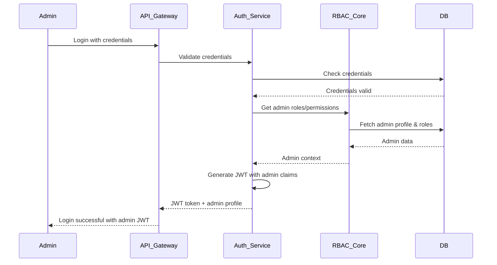

#### User Invitation by Admin (`POST /api/tenants/:tenant_id/users/invite`)

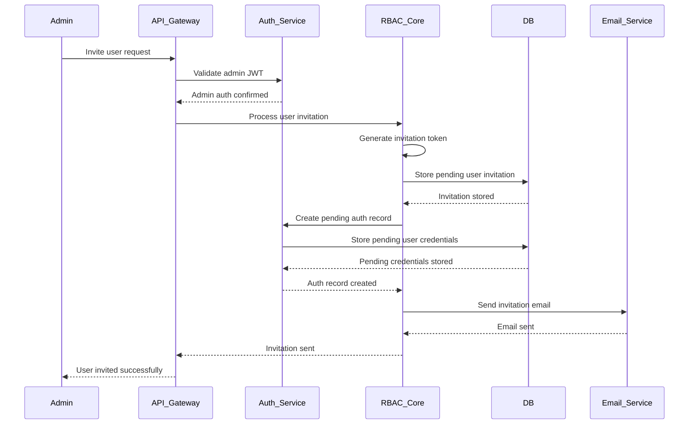

#### User Registration via Invitation (`POST /api/auth/register-invited`)

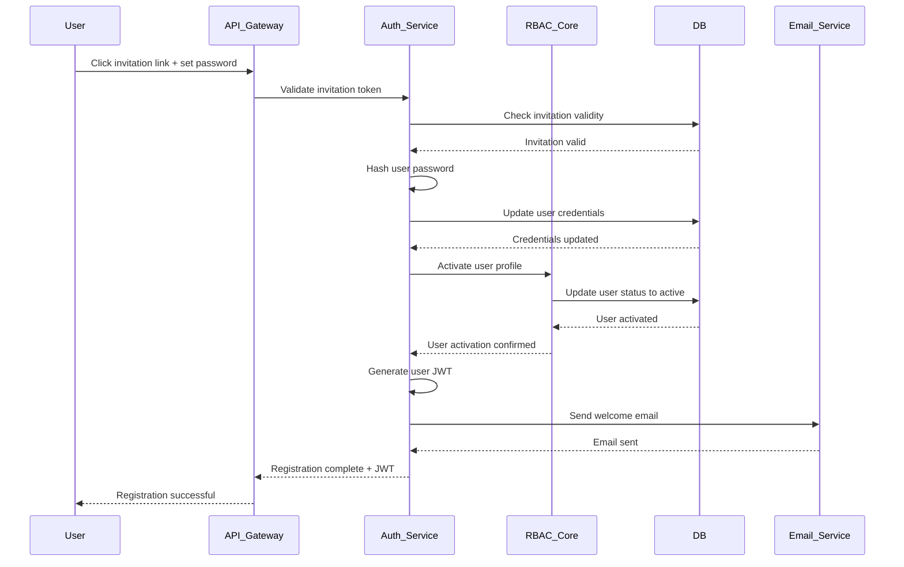

### User Flows

#### Add/Invite User (`POST /api/tenants/:tenant_id/users`)

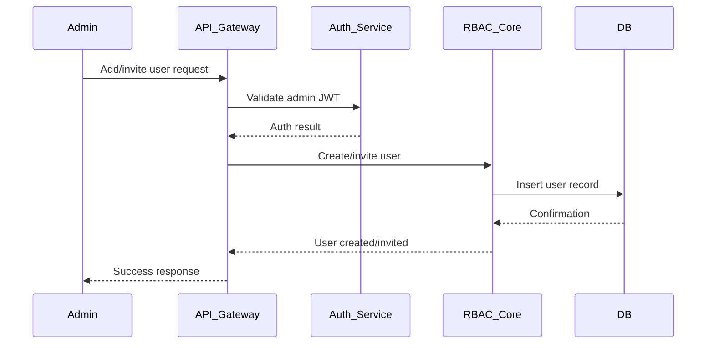

### Role Flows

#### Create Role (`POST /api/tenants/:tenant_id/roles`)

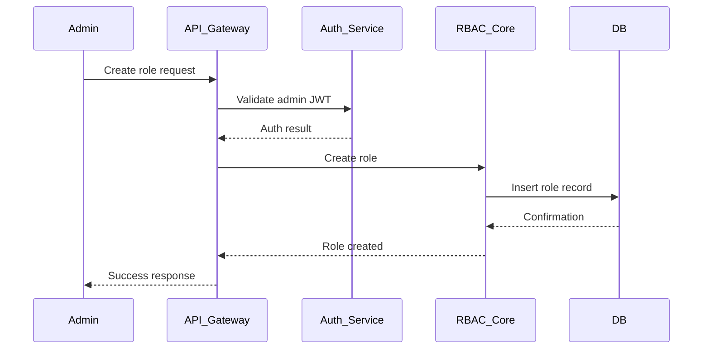

### Resource Flows

#### Register Resource (`POST /api/tenants/:tenant_id/resources`)

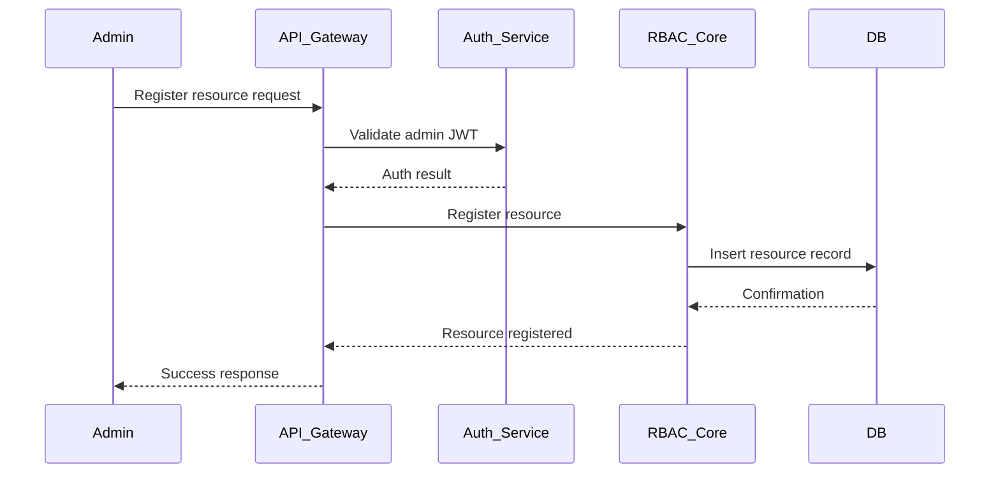

### Auth Flows

#### Login/Authenticate (JWT)

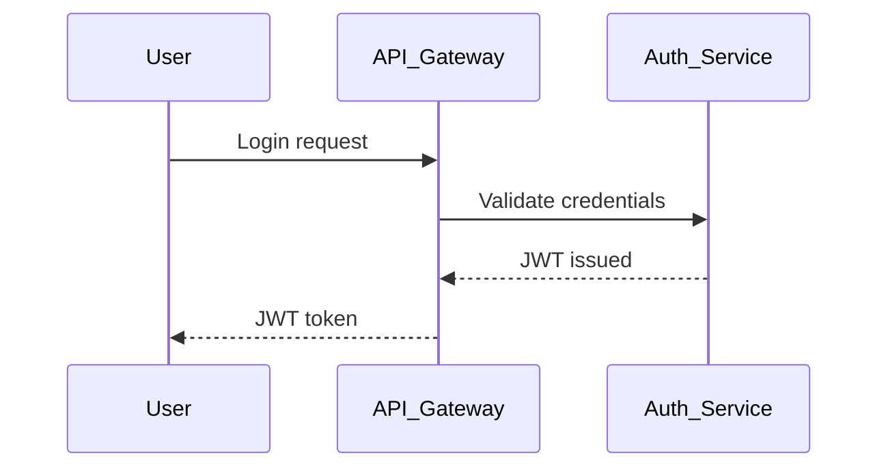

### Policy Flows

#### Permission Check (`POST /api/authorize`)

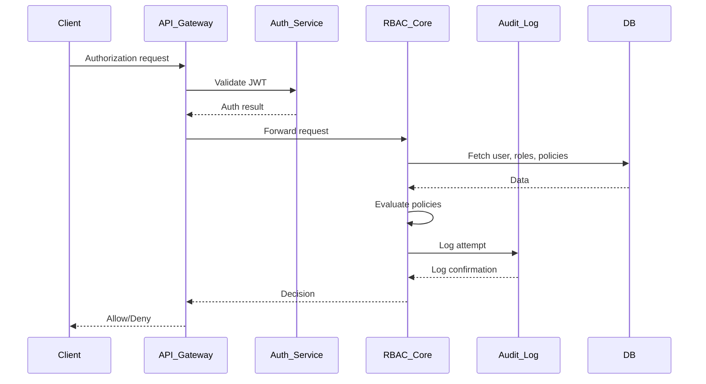

#### Policy Simulation (`GET /api/tenants/:tenant_id/policy-simulate`)

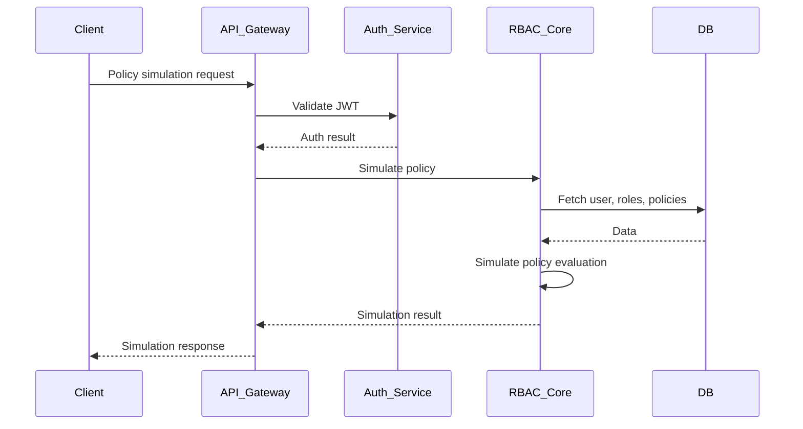

### Audit Flows

#### Audit Log Fetch (`GET /api/tenants/:tenant_id/audit-logs`)

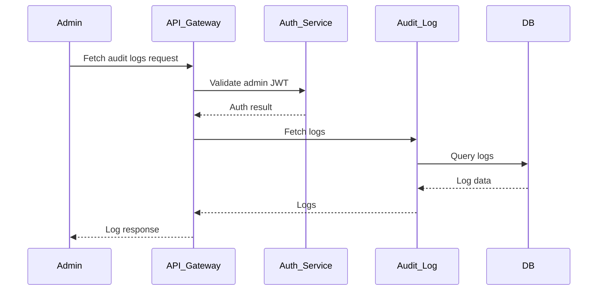

## 3. Component Responsibilities

### API Gateway

- Entry point, authentication, routing, rate limiting, logging, API docs

### RBAC Core

- Tenants, users, roles, resources, policies
- Permission checks, policy evaluation

### Auth Service

- JWT/OAuth2 authentication, login, SSO/IdP integration (future)

### Audit Log Service

- Policy updates, permission checks, admin actions

### Database

- Multi-tenant isolation, migrations, seeders

## 4. Coverage Checklist

| Component            | Status      | Notes                                   |
| -------------------- | ----------- | --------------------------------------- |
| API Gateway          | Implemented | Swagger, logging, rate limiting present |
| RBAC Core            | Implemented | Policy engine, entities, DTOs present   |
| Auth Service         | Implemented | JWT, login endpoints                    |
| Audit Log Service    | Implemented | Logging actions, policy changes         |
| SSO/IdP Integration  | Planned     | OAuth2, external IdP support            |
| Resource Management  | Partial     | CRUD endpoints, types                   |
| Analytics/Reporting  | Planned     | Usage, compliance, access logs          |
| gRPC/GraphQL Support | Planned     | API protocol alternatives               |
| CI/CD Pipeline       | Partial     | GitHub Actions, needs deploy steps      |
| Multi-Region/HA      | Planned     | Scalability, failover                   |
| Test Coverage        | Partial     | E2E, integration, unit tests            |

## 5. Recommendations & Next Steps

- Implement SSO/IdP integration for enterprise use cases
- Expand policy engine for attribute-based and custom conditions
- Add analytics/reporting microservice
- Enhance CI/CD for automated deployment
- Increase test coverage (unit, integration, E2E)
- Document API endpoints and flows in `/docs`
- Plan for multi-region deployment and HA

## 6. Policy Examples & Sample Data

### Policy Schema Format

```json
{
  "Version": "2025-09-17",
  "Statement": [
    {
      "Effect": "Allow",
      "Action": ["resource:read", "resource:update"],
      "Resource": ["arn:app:tenantX:resource:abc123"],
      "Condition": {
        "StringEquals": { "user:department": "engineering" }
      }
    }
  ]
}
```

### Sample Policy Examples

#### Administrative Policy

```json
{
  "Version": "2025-09-17",
  "Statement": [
    {
      "Effect": "Allow",
      "Action": ["*"],
      "Resource": ["arn:app:tenant-123:*"],
      "Condition": {
        "StringEquals": { "user:role": "admin" }
      }
    }
  ]
}
```

#### Read-Only User Policy

```json
{
  "Version": "2025-09-17",
  "Statement": [
    {
      "Effect": "Allow",
      "Action": ["resource:read", "user:profile:read"],
      "Resource": [
        "arn:app:tenant-123:resource:*",
        "arn:app:tenant-123:user:self"
      ],
      "Condition": {
        "StringEquals": { "user:status": "active" }
      }
    }
  ]
}
```

#### Department-Based Policy

```json
{
  "Version": "2025-09-17",
  "Statement": [
    {
      "Effect": "Allow",
      "Action": ["document:read", "document:write"],
      "Resource": ["arn:app:tenant-123:document:*"],
      "Condition": {
        "StringEquals": { "user:department": "hr" },
        "StringLike": { "resource:category": "hr-*" }
      }
    }
  ]
}
```

## 7. Sample API Requests & Responses

### Admin Registration & User Invitation APIs

#### Register Admin User (Bootstrap/Super Admin Only)

**Request:**

```http
POST /api/auth/register-admin
Content-Type: application/json
Authorization: Bearer <super_admin_jwt> OR Bootstrap-Token: <bootstrap_secret>

{
  "email": "admin@company.com",
  "password": "SecurePassword123!",
  "profile": {
    "firstName": "System",
    "lastName": "Administrator",
    "department": "IT"
  },
  "permissions": ["system:admin", "tenant:manage", "user:manage"],
  "metadata": {
    "registeredBy": "bootstrap",
    "level": "super_admin"
  }
}
```

**Response:**

```json
{
  "id": "admin-001",
  "email": "admin@company.com",
  "status": "pending_activation",
  "activationToken": "act_token_xyz",
  "roles": ["system_admin"],
  "permissions": ["system:admin", "tenant:manage", "user:manage"],
  "createdAt": "2025-09-17T10:00:00Z",
  "message": "Admin registered. Please check email for activation link."
}
```

#### Admin Login

**Request:**

```http
POST /api/auth/login
Content-Type: application/json

{
  "email": "admin@company.com",
  "password": "SecurePassword123!",
  "userType": "admin"
}
```

**Response:**

```json
{
  "accessToken": "eyJhbGciOiJIUzI1NiIsInR5cCI6IkpXVCJ9...",
  "refreshToken": "refresh_token_abc",
  "user": {
    "id": "admin-001",
    "email": "admin@company.com",
    "roles": ["system_admin"],
    "permissions": ["system:admin", "tenant:manage", "user:manage"],
    "profile": {
      "firstName": "System",
      "lastName": "Administrator"
    }
  },
  "tokenType": "Bearer",
  "expiresIn": 3600
}
```

#### Invite User to Tenant

**Request:**

```http
POST /api/tenants/tenant-123/users/invite
Content-Type: application/json
Authorization: Bearer <admin_jwt>

{
  "email": "john.doe@acme.com",
  "profile": {
    "firstName": "John",
    "lastName": "Doe",
    "department": "engineering",
    "title": "Senior Developer"
  },
  "roleIds": ["role-456"],
  "permissions": ["project:read", "project:write"],
  "invitationMessage": "Welcome to Acme Corp! Please complete your registration.",
  "expiresInDays": 7
}
```

**Response:**

```json
{
  "invitationId": "inv-789",
  "userId": "user-pending-123",
  "email": "john.doe@acme.com",
  "status": "invitation_sent",
  "invitationToken": "inv_secure_token_xyz",
  "invitationUrl": "https://app.acme.com/register?token=inv_secure_token_xyz",
  "expiresAt": "2025-09-24T10:05:00Z",
  "sentAt": "2025-09-17T10:05:00Z",
  "invitedBy": "admin-001"
}
```

#### User Registration via Invitation

**Request:**

```http
POST /api/auth/register-invited
Content-Type: application/json

{
  "invitationToken": "inv_secure_token_xyz",
  "password": "UserPassword123!",
  "confirmPassword": "UserPassword123!",
  "acceptTerms": true,
  "profile": {
    "phoneNumber": "+1-555-0123",
    "timezone": "America/New_York",
    "preferences": {
      "emailNotifications": true,
      "language": "en"
    }
  }
}
```

**Response:**

```json
{
  "accessToken": "eyJhbGciOiJIUzI1NiIsInR5cCI6IkpXVCJ9...",
  "refreshToken": "refresh_token_def",
  "user": {
    "id": "user-789",
    "email": "john.doe@acme.com",
    "status": "active",
    "tenantId": "tenant-123",
    "roles": ["role-456"],
    "permissions": ["project:read", "project:write"],
    "profile": {
      "firstName": "John",
      "lastName": "Doe",
      "department": "engineering",
      "title": "Senior Developer"
    }
  },
  "tenant": {
    "id": "tenant-123",
    "name": "Acme Corporation",
    "slug": "acme-corp"
  },
  "message": "Registration completed successfully!"
}
```

### Create Tenant

**Request:**

```http
POST /api/tenants
Content-Type: application/json
Authorization: Bearer <admin_jwt>

{
  "name": "Acme Corporation",
  "slug": "acme-corp",
  "description": "Technology company",
  "config": {
    "maxUsers": 1000,
    "features": ["sso", "audit", "analytics"]
  }
}
```

**Response:**

```json
{
  "id": "tenant-123",
  "name": "Acme Corporation",
  "slug": "acme-corp",
  "status": "active",
  "createdAt": "2025-09-17T10:00:00Z"
}
```

### Add User to Tenant

**Request:**

```http
POST /api/tenants/tenant-123/users
Content-Type: application/json
Authorization: Bearer <admin_jwt>

{
  "email": "john.doe@acme.com",
  "profile": {
    "firstName": "John",
    "lastName": "Doe",
    "department": "engineering"
  },
  "roleIds": ["role-456"]
}
```

**Response:**

```json
{
  "id": "user-789",
  "email": "john.doe@acme.com",
  "status": "pending_invitation",
  "invitationToken": "inv_token_xyz",
  "createdAt": "2025-09-17T10:05:00Z"
}
```

### Create Role

**Request:**

```http
POST /api/tenants/tenant-123/roles
Content-Type: application/json
Authorization: Bearer <admin_jwt>

{
  "name": "Engineering Lead",
  "description": "Lead engineers with team management access",
  "type": "custom",
  "permissions": ["user:manage", "project:read", "project:write"],
  "metadata": {
    "level": "senior",
    "department": "engineering"
  }
}
```

**Response:**

```json
{
  "id": "role-456",
  "name": "Engineering Lead",
  "type": "custom",
  "systemRole": false,
  "createdAt": "2025-09-17T10:10:00Z"
}
```

### Authorization Check

**Request:**

```http
POST /api/authorize
Content-Type: application/json
Authorization: Bearer <user_jwt>

{
  "userId": "user-789",
  "action": "document:read",
  "resource": "arn:app:tenant-123:document:doc-001",
  "context": {
    "ip": "192.168.1.100",
    "userAgent": "Mozilla/5.0...",
    "department": "engineering"
  }
}
```

**Response:**

```json
{
  "decision": "ALLOW",
  "principal": "user-789",
  "action": "document:read",
  "resource": "arn:app:tenant-123:document:doc-001",
  "evaluatedAt": "2025-09-17T10:15:00Z",
  "policies": [
    {
      "id": "policy-001",
      "name": "Engineering Document Access",
      "effect": "ALLOW"
    }
  ]
}
```

### Policy Simulation

**Request:**

```http
POST /api/tenants/tenant-123/policy-simulate
Content-Type: application/json
Authorization: Bearer <admin_jwt>

{
  "userId": "user-789",
  "scenarios": [
    {
      "action": "document:delete",
      "resource": "arn:app:tenant-123:document:doc-001"
    },
    {
      "action": "user:create",
      "resource": "arn:app:tenant-123:user:*"
    }
  ]
}
```

**Response:**

```json
{
  "userId": "user-789",
  "results": [
    {
      "action": "document:delete",
      "resource": "arn:app:tenant-123:document:doc-001",
      "decision": "DENY",
      "reason": "No matching policy allows this action"
    },
    {
      "action": "user:create",
      "resource": "arn:app:tenant-123:user:*",
      "decision": "ALLOW",
      "matchedPolicy": "policy-002"
    }
  ],
  "simulatedAt": "2025-09-17T10:20:00Z"
}
```

### Fetch Audit Logs

**Request:**

```http
GET /api/tenants/tenant-123/audit-logs?limit=10&action=permission_check
Authorization: Bearer <admin_jwt>
```

**Response:**

```json
{
  "logs": [
    {
      "id": "log-001",
      "tenantId": "tenant-123",
      "userId": "user-789",
      "action": "permission_check",
      "resource": "arn:app:tenant-123:document:doc-001",
      "result": "success",
      "metadata": {
        "decision": "ALLOW",
        "policies": ["policy-001"]
      },
      "timestamp": "2025-09-17T10:15:00Z"
    }
  ],
  "pagination": {
    "total": 1,
    "limit": 10,
    "offset": 0
  }
}
```

## 8. Advanced Policy Patterns

### Time-Based Access

```json
{
  "Version": "2025-09-17",
  "Statement": [
    {
      "Effect": "Allow",
      "Action": ["system:access"],
      "Resource": ["*"],
      "Condition": {
        "DateGreaterThan": { "aws:CurrentTime": "09:00:00Z" },
        "DateLessThan": { "aws:CurrentTime": "17:00:00Z" },
        "ForAllValues:StringEquals": { "aws:RequestedRegion": ["us-east-1"] }
      }
    }
  ]
}
```

### IP-Based Restrictions

```json
{
  "Version": "2025-09-17",
  "Statement": [
    {
      "Effect": "Deny",
      "Action": ["*"],
      "Resource": ["*"],
      "Condition": {
        "NotIpAddress": { "aws:SourceIp": ["192.168.1.0/24", "10.0.0.0/8"] }
      }
    }
  ]
}
```

## 11. Advanced Policy Patterns

### Time-Based Access

```json
{
  "Version": "2025-09-17",
  "Statement": [
    {
      "Effect": "Allow",
      "Action": ["system:access"],
      "Resource": ["*"],
      "Condition": {
        "DateGreaterThan": { "aws:CurrentTime": "09:00:00Z" },
        "DateLessThan": { "aws:CurrentTime": "17:00:00Z" },
        "ForAllValues:StringEquals": { "aws:RequestedRegion": ["us-east-1"] }
      }
    }
  ]
}
```

### IP-Based Restrictions

```json
{
  "Version": "2025-09-17",
  "Statement": [
    {
      "Effect": "Deny",
      "Action": ["*"],
      "Resource": ["*"],
      "Condition": {
        "NotIpAddress": { "aws:SourceIp": ["192.168.1.0/24", "10.0.0.0/8"] }
      }
    }
  ]
}
```

## 12. Implementation Checklist for Registration Flows

### Auth Service Implementation

- [ ] Admin registration endpoint with bootstrap security
- [ ] Invitation token generation and validation
- [ ] Password policy enforcement
- [ ] JWT token generation with proper claims
- [ ] Credential storage and hashing
- [ ] Token expiration handling
- [ ] Duplicate email detection

### RBAC Core Implementation

- [ ] User invitation business logic
- [ ] Tenant-scoped user creation
- [ ] Role assignment during invitation
- [ ] Permission validation for admin actions
- [ ] User status management (pending → active)
- [ ] Invitation expiration cleanup

### API Gateway Implementation

- [ ] Admin registration route (bootstrap only)
- [ ] User invitation routes with admin auth
- [ ] Invitation acceptance routes
- [ ] Error handling and validation
- [ ] Rate limiting for registration endpoints
- [ ] API documentation for all flows

### Database Migrations

- [ ] Auth credentials table
- [ ] Auth tokens table
- [ ] User profiles with tenant isolation
- [ ] User roles assignment table
- [ ] Audit logs for registration events
- [ ] Indexes for performance

### Email Service Integration

- [ ] Invitation email templates
- [ ] Welcome email templates
- [ ] Password reset email templates
- [ ] Email delivery tracking
- [ ] Configurable email settings per tenant

## 13. References & Resources

- [NestJS Docs](https://docs.nestjs.com)
- [Nx Monorepo](https://nx.dev)
- [TypeORM](https://typeorm.io)
- [Policy-based Authorization (IAM)](https://docs.aws.amazon.com/IAM/latest/UserGuide/access_policies.html)
- [JWT Best Practices](https://tools.ietf.org/html/rfc8725)
- [OWASP Authentication Cheat Sheet](https://cheatsheetseries.owasp.org/cheatsheets/Authentication_Cheat_Sheet.html)

---

This document provides comprehensive end-to-end clarity on admin registration, user invitation flows, service communication patterns, security considerations, and implementation guidelines for the multi-tenant RBAC/IAM system.
